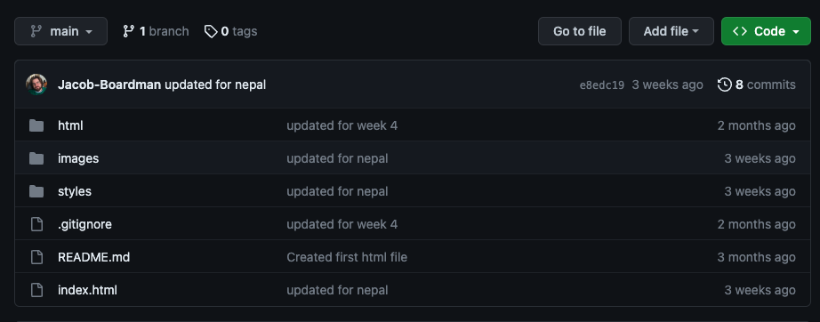
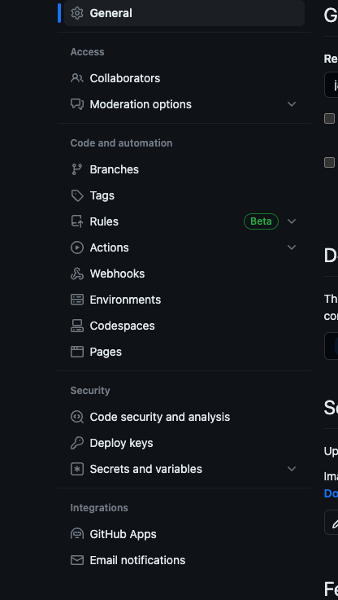

# Code the Future </>

## Session 1: Hosting on Github Pages

### Content covered in this session

- What is Github Pages
- Setting up your repository
- Hosting repository

### Session Goals

- Learn about Github Pages
- Configure your Repository to work with Pages
- See your repository being hosted

### What is Github Pages

GitHub Pages is a static site hosting service that takes HTML, CSS, and JavaScript files straight from a repository on GitHub, optionally runs the files through a build process, and publishes a website. This gives us a way to be able to host websites for free within our accounts for a single site.

**What is the difference between Github and Github Pages?**

The purpose of GitHub Pages is to provide the GitHub user a way to create personal websites for themselves and websites for their projects / repositories. For each registered GitHub account (representing a user or an organization) you can register one User Page, but an unlimited Project pages.

Github pages can be used to host more complex projects that might use a framework such as React, VueJS or Angualr, but woudl require a but more setup for us to acheive, but would be great to research in your own time if you are interested.

### Setting up your repository

To set up our repositry there are a couples things to look out for:

- The name of the Repository
- The structure of content in the repository

First off with the repository that name, there is a certain convention you have to use so that github pages can propely be hosted. This convention is {_your github username_}.github.io e.g. `joe.blogs.github.io` or `persion142.github.io`. The usernam section has to be spelled exaclty how your user name is so that it can link you user with the repository and host the page correctly. If the repositrory you have made doesn't follow this you can change the name of an existing repository to match this is you wanted.

First go to the Settings section of your reposity.

Second edit the Repository name under the general settings tab to match the nameing convention needed.

Second is the structure of the page. below is an exmaple of the structure.

Here we can see what is needed at what is called the top we want out index.html and README.md file, below this we woudl want to create folders for the other pages, the style and images we woudl use within out webpage.

**_THE BASE FILE NEEDS TO BE NAMED/KEPT AS `index.html`_**

The reason that this file needs to stay named teh way it is, is beacuse Github Pages will try and look for this this file first to host it. If it can't find an index.html file it will look for a README.md file to host, if neither file are not found it will not be hosted correctly.

### Hosting your Repository

Once all your files are correctly setup and is named correctly we can start hosting our website.

Firstly go to your repository on Github.com and clickl on the settings section at the top.

Next on the left hand side you want to cliock on Pages under the Code and automation tab.

Then once located ont hat page you want to keep the source as `Deploy from a branch`, under that we set the branhc settings. Set the left box (The branch box) `as main`, and set the next box a long to `/(root)`, and click on `Save`.

Here is an image below showing the settings set in the pages section. If you have a custom domain sorted already you can use this custom domain name.

After a few minuets your page should now be hosted on Github pages ready for you to share. Once the page is done you you will have section at the top that will appear showing you the name/url of the page and if you want to stop hosting it.

This will be nice progressing further in the course as when you make changes and push your changes to this repository a build is ran in the background that will we build the site with your updated code.

## References

- [Basic Tutorial](https://pages.github.com/)
- [VueJS Framework Tutorial](https://learnvue.co/articles/deploy-vue-to-github-pages)

<a href='intro_to_github.md'><-- Previous section: Introduction to Git & GitHub</a>

<a  href='../session-2/README.md'>Next section: Session 2 Introduction --></a>

